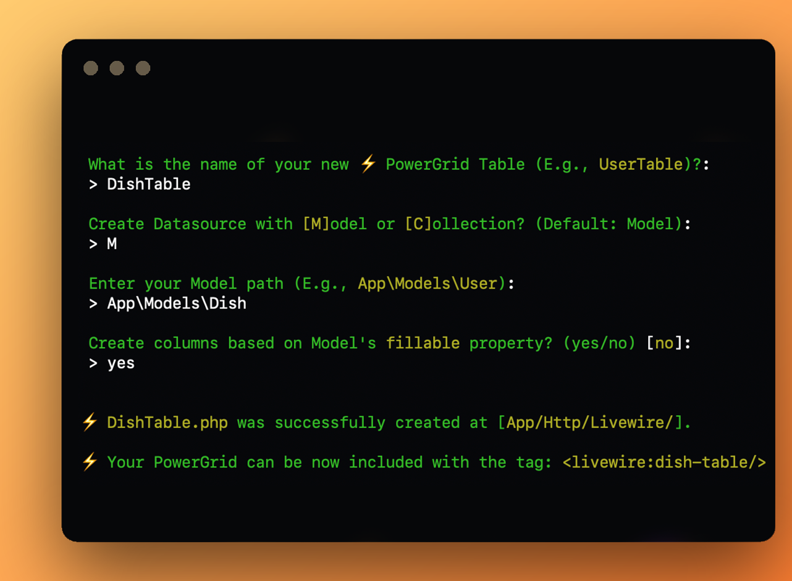

# Create a PowerGrid Table

!> **Important** You must have PowerGrid [installed](get-started/install?id=install) and properly [configured](get-started/configure?id=configure) before proceeding.


To create a PowerGrid table, run the following command:

```bash
php artisan powergrid:create  
```

<br>

Now, answer the question in your screen to complete the creation process:

**1. Enter the name of your PowerGrid Component.**

For example: `DishTable`.

---

**2. Indicate if your component will use a Model or a Collection as data source.**

Type `M` for Model or `C` for Collection.


This example uses the Dish Model, so we typed `M`:


---

**3. If you choose Model, enter the path to your Model.**

In this example, the Dish Model is located at App\Models\Dish.

If you don't specify App\Models -powergrid will create based on default App\Models directory.


---

**4. Use Fillable?**

PowerGrid can create columns based on your Model's `fillable` property.

Supported databases are: MySQL, Postgre and SQLite.

If desirable, type `yes` to use this feature.

> If you don't use the 'id' column as the primary key, you should make sure your model is `protected $primaryKey = null`;

---

**⚡ PowerGrid Table created!**

PowerGrid indicates the location where your new Table component was created.

You can also see the syntax to include the Table in your page:


<hr/>
<footer style="float: right; font-size: larger">
    <span><a style="text-decoration: none;" href="#/get-started/use-your-powergrid-table">Use your PowerGrid Table →</a></span>
</footer>
